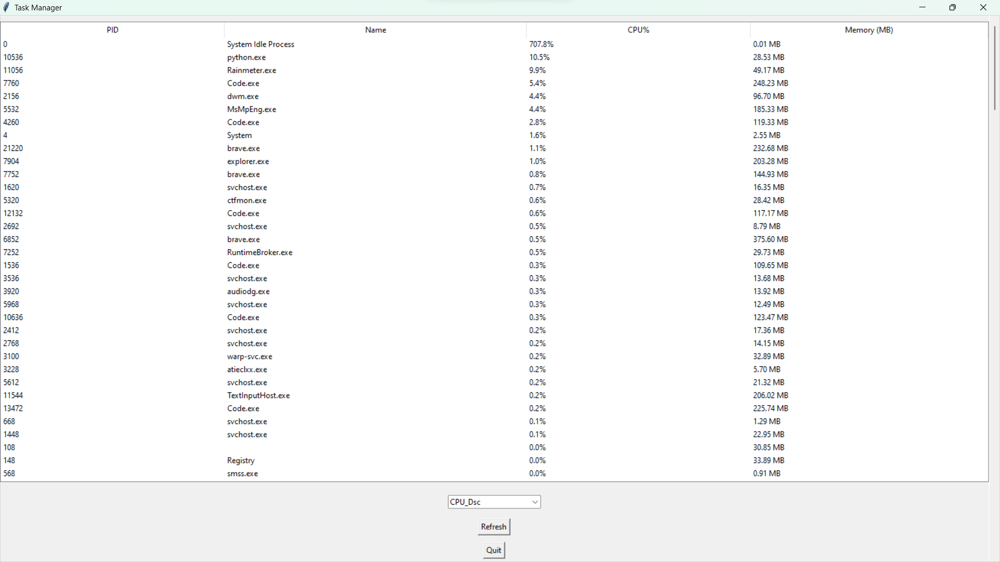

# System Stats 📊

**System Stats** is a Python-based desktop application that allows users to view real-time system performance statistics, such as CPU usage, memory usage, and the currently running processes on their machine. It also provides functionality to sort the process list by CPU and memory usage in ascending or descending order.

This tool uses the `psutil` library to gather system information and `tkinter` to create a simple yet effective graphical user interface (GUI).

---

## Features

- View a live list of running processes, including:
  - **PID (Process ID)**
  - **Process Name**
  - **CPU Usage (%)**
  - **Memory Usage (MB)**
- **Sort** processes by:
  - CPU usage (Ascending/Descending)
  - Memory usage (Ascending/Descending)
- **Refresh** the process list to get updated information.
- Clean and simple **Tkinter GUI** for displaying system stats.

---

Here is the screenshot of the program:


**Screenshot of UI*

---

## Requirements

Before running **System Stats**, make sure you have Python installed on your machine. This project requires the following Python packages:

- `psutil` — To fetch system-related information like CPU, memory, and processes.
- `tkinter` — To create the GUI (typically comes pre-installed with Python).

You can install the required dependencies using the following command:

```bash
pip install psutil
```

### Note:
- **`tkinter`** is included with standard Python installations on Windows and macOS. On some Linux distributions, you may need to install it manually (see the **Installation** section below).

---

## Installation

### 1. **Clone the Repository**

You can clone this repository using Git:

```bash
git clone https://github.com/<your-username>/system-stats.git
cd system-stats
```

### 2. **Install Dependencies**

Make sure you have the required Python packages:

```bash
pip install psutil
```

### 3. **Install `tkinter` (if necessary)**

- **Windows/macOS**: `tkinter` is usually pre-installed.
- **Linux** (Ubuntu/Debian):

```bash
sudo apt-get install python3-tk
```

---

## Usage

1. **Running the Application**:
   To run the application, execute the following command:

   ```bash
   python system_stats.py
   ```

2. **Interacting with the App**:
   - The **process list** will be displayed, showing the **PID**, **process name**, **CPU usage**, and **memory usage**.
   - You can **sort** the process list using the dropdown menu at the top of the window, allowing you to choose between sorting by:
     - **CPU (Ascending/Descending)**
     - **Memory (Ascending/Descending)**
   - To refresh the process list and get updated information, click the **Refresh** button.
   - To quit the application, click the **Quit** button.

---


## Contributing

Feel free to fork this project and contribute! Here are some ways you can help:

- Report bugs or issues you encounter.
- Suggest new features or improvements.
- Submit pull requests with bug fixes or new features.


---
